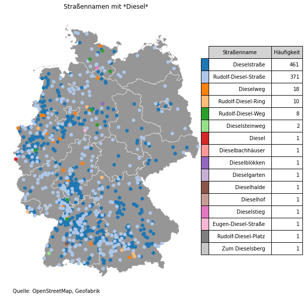
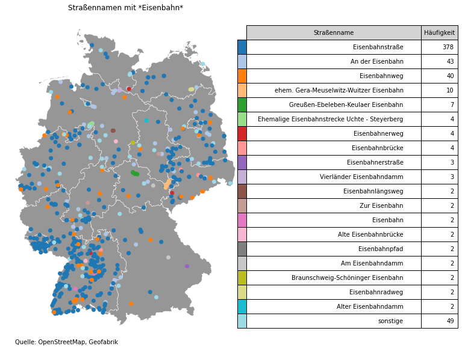

# osm_analyse_strassennamen

Kurze Erklärung und Beispiel für die Extrahierung und Nutzung von größeren OSM-Datensätzen mit Windows.
(Für kleine Bereiche oder seltene Tags würde ich auch weiterhin Overpass empfehlen.)

Der hier beschriebene Ansatz basiert auf dem Tutorial von Hans Hack
https://journocode.com/2018/01/extract-geodata-openstreetmap-osmfilter/

In meinem Beispielcode habe ich jedoch die externen Programme nicht in der Shell sondern direkt in  python/jupyter ausgeführt, was Reproduzierbarkeit etwas vereinfacht und trotzdem die Performance der externen Programme osmconvert und osmfilter nutzt.

### OSM Datenquelle:

https://download.geofabrik.de/europe/germany.html

### Programme:

* osmfilter -> [wiki.openstreetmap.org/wiki/Osmfilter](http://wiki.openstreetmap.org/wiki/Osmfilter)
* osmconvert -> [wiki.openstreetmap.org/wiki/Osmconvert](http://wiki.openstreetmap.org/wiki/Osmconvert)

### python libraries:

* insb. geopandas (darin erhalten auch die nötige gdal)
* http://svn.osgeo.org/gdal/trunk/gdal/swig/python/samples/ogr2ogr.py
  * einfach in ausführenden Ordner legen (sie o.g. Programme)

##  Vorgehen:

Zunächst bei geofabrik für das gewünschte Gebiet die **osm.pbf-Datei** (am besten klein anfangen, bspw. Saarland), sowie die beiden Programme **osmconvert** und **osmfilter** und das python-skript **ogr2ogr**.py (siehe oben) herunterladen. Alles zusammen mit dem hier hinterlegten **juypter-notepad** (.ipynb) in einen Ordner legen. Stelle sicher, dass in dem python-Environment die nötigen libaries (geopandas, ggf. matplotlib) installiert sind.
Nun können der Reihe nach die Zellen im notepad ausgeführt werden und entsprechend die Pfade angepasst werden.

##  Beispiele :

